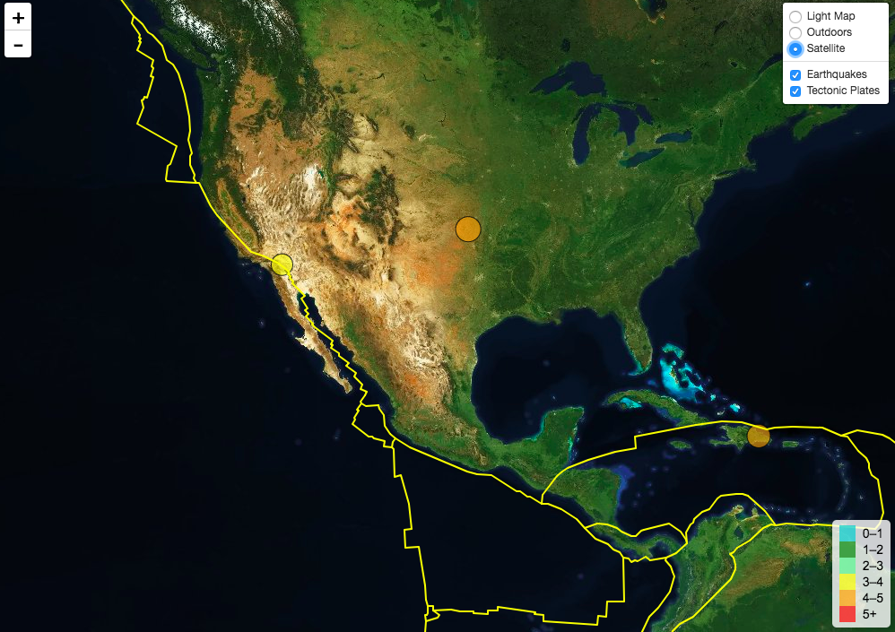

# Unit 17 | Assignment - Visualizing Data with Leaflet

## Background

### Step 1: Basic Visualization

Visualization earthquake data set.

- - -

### Step 2: More Data

Gey more data and more layers of your visulization.

* Plot a second data set on our map.

* Add a number of base maps to choose from as well as separate out our two different data sets into overlays that can be turned on and off independently.

* Add layer controls to our map.

- - -

### Step 3: Time Keeps on Ticking

Find out the earthquake places.
* Using a Leaflet plugin (they can be found at <http://leafletjs.com/plugins.html>) to visualize your earthquake as it takes place over a period of time.

